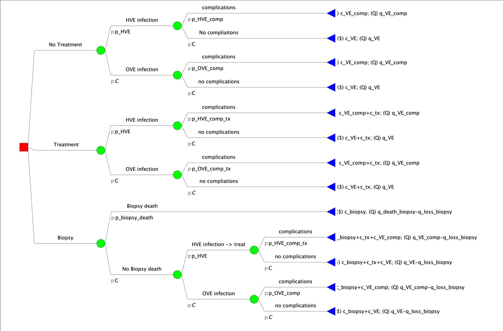

Developed by the Decision Analysis in R for Technologies in Health (DARTH) workgroup:
Fernando Alarid-Escudero, PhD  
Eva A. Enns, MS, PhD 
M.G. Myriam Hunink, MD, PhD 
Hawre J. Jalal, MD, PhD 
Eline Krijkamp, PhD 
Petros Pechlivanoglou, PhD
Alan Yang, MSc

Please cite relevant publications when using this code, see suggestions below. 


\newpage

```{r setup, include=FALSE}
knitr::opts_chunk$set(echo = TRUE, warning = FALSE, message = FALSE, eval = FALSE)
```

Change `eval` to `TRUE` if you want to knit this document.

```{r}
rm(list = ls())      # clear memory (removes all the variables from the workspace)
```

# 00 Case example
Viral encephalitis can be caused by herpes viruses (HVE) or other viruses (OVE). Herpes viruses cause approximately 52% of cases of viral encephalitis. Without treatment, the risk of complications (death or severe sequelae) for HVE is 71%; for OVE, the risk is only 1%. A drug, vidarabine, decreases the likelihood of complications due to HVE from 71% down to 36%. However, among OVE patients, treatment with vidarabine is associated with severe side effects, increasing the risk of complications from the 1% baseline to 20%. It is possible to obtain a definitive diagnosis of HVE by means of a brain biopsy, but the procedure itself also has a 5% probability of inducing complications.

You are tasked with evaluating the healthcare costs and benefits associated with three possible management strategies (no treatment, vidarabine treatment, or brain biopsy followed by vidarabine treatment for those who are diagnosed with HVE). Benefits will be measured in terms of quality-adjusted life-years (QALYs). 

The healthcare cost of a case of viral encephalitis without complications is \$1,200; however, if complications occur, the cost rises to \$9,000. The cost of vidarabine treatment is \$9,500, while a brain biopsy is a \$25,000 procedure. 

A patient who recovers from viral encephalitis without complications has an average of 20 remaining QALYs; however, a patient who experiences complications has an average of 19 remaining QALYs. Since a brain biopsy is an unpleasant procedure, patients who undergo it also experience a one-time loss of 0.01 QALYs regardless of the outcome of the biopsy.

Parameters are summarized in Table 1 and the tree structure is shown in the figure below. 

```{r, echo = F, warning = F, message = F, out.width = '100%', fig.cap = 'Schematic representation of the Sick-Sicker model', fig.align = 'center'}
if (!require(knitr)) install.packages('knitr')

```


# 01 Load packages

```{r, warning = FALSE, message = FALSE}
if (!require('pacman')) install.packages('pacman'); library(pacman) # use this package to conveniently install other packages
# load (install if required) packages from CRAN
p_load("dplyr", "devtools", "scales", "ellipse", "ggplot2", "lazyeval", "igraph",  "ggraph", "reshape2", "knitr", "stringr", "dampack")
# load (install if required) packages from GitHub
p_load_gh("DARTH-git/darthtools")
```

# 02 Load functions

```{r}
# all functions are in the darthtools package so no need for additional functions
```

# 03 Define parameter input values

```{r}
v_names_str    <- c("No Tx", "Tx All", "Biopsy")  # names of strategies, no treatment, treatment and biopspy
n_str          <- length(v_names_str)             # number of strategies
wtp            <- 100000                          # willingness to pay threshold

# Probabilities
p_HVE          <- 0.52   # prevalence of HVE
p_HVE_comp     <- 0.71   # complications with untreated HVE
p_OVE_comp     <- 0.01   # complications with untreated OVE
p_HVE_comp_tx  <- 0.36   # complications with treated HVE
p_OVE_comp_tx  <- 0.20   # complications with treated OVE
p_biopsy_death <- 0.005  # probability of death due to biopsy

# Costs
c_VE           <- 1200   # cost of viral encephalitis care without complications
c_VE_comp      <- 9000   # cost of viral encephalitis care with complications
c_tx           <- 9500   # cost of treatment
c_biopsy       <- 25000  # cost of brain biopsy
c_death_biopsy <- 0      # cost of dying from brain biopsy

# QALYs
q_VE           <- 20     # remaining QALYs for those without VE-related complications
q_VE_comp      <- 19     # remaining QALYs for those with    VE-related complications
q_loss_biopsy  <- 0.01   # one-time  QALY loss due to brain biopsy
q_death_biopsy <- 0      # remaining QALYs for those who died during biopsy
```

# 04 Create and run decision tree model
## 04.1 Create vectors of weights for each strategy 
```{r}
# Create vector of weights for each strategy 
v_w_no_tx  <- c(    p_HVE  *      p_HVE_comp     ,  # HVE, complications
                    p_HVE  * (1 - p_HVE_comp)    ,  # HVE, no complications
               (1 - p_HVE) *      p_OVE_comp     ,  # OVE, complications
               (1 - p_HVE) * (1 - p_OVE_comp))      # OVE, no complications
  
v_w_tx     <- c(    p_HVE  *      p_HVE_comp_tx  ,  # HVE w/tx, complications
                    p_HVE  * (1 - p_HVE_comp_tx) ,  # HVE w/tx, no complications
               (1 - p_HVE) *      p_OVE_comp_tx  ,  # OVE w/tx, complications
               (1 - p_HVE) * (1 - p_OVE_comp_tx))   # OVE w/tx, no complications
  
v_w_biopsy <- c(    p_biopsy_death                   ,  # biopsy death
               # no biopsy death.,   HVE w/tx,        complications
               (1 - p_biopsy_death)   *      p_HVE  *    p_HVE_comp_tx  ,  
               # no biopsy death.,   HVE w/tx,     no complications
               (1 - p_biopsy_death)   *      p_HVE  * (1 - p_HVE_comp_tx) ,  
               # no biopsy death.,        OVE,        complications
               (1 - p_biopsy_death)   * (1 - p_HVE) *      p_OVE_comp   ,  
               # no biopsy death.,        OVE,     no complications
               (1 - p_biopsy_death)   * (1 - p_HVE) * (1 - p_OVE_comp))      
```

##04.1.1 Extra code to demonstrate the use of "clones"
The structure of a decision tree consist of replication parts. 
To avoid coding the same equation multiple times, we can make use of a function that calculated that section.
This is comparable, with what is in specialized software called a clone. 
In de code chunk below, we show how we first develop the clone function. And next how to use the function. Finally, we demonstrate that we get identical results compared to what we had before. 
```{r}
# Develop a function to calculate the vector of weights for the decision tree
calculate_hve_complication <- function(p_HVE, p_HVE_comp, p_OVE_comp){
    # p_HVE: the probability of having p_HVE
    # p_HVE_comp: the probability of getting a complication when you have an HVE infection
    # p_OVE_comp: the probability of getting a complication when you have an OVE infection
       v_weights <-  c(    p_HVE  *      p_HVE_comp     ,  # HVE, complications
                            p_HVE  * (1 - p_HVE_comp)    ,  # HVE, no complications
                       (1 - p_HVE) *      p_OVE_comp     ,  # OVE, complications
                       (1 - p_HVE) * (1 - p_OVE_comp))
        return (v_weights) # return the vector of weights
         }

# Create vector of weights for each strategy using the function 
v_w_no_tx_clone  <- calculate_hve_complication(p_HVE = p_HVE, p_HVE_comp = p_HVE_comp, p_OVE_comp = p_OVE_comp)
  
v_w_tx_clone     <- calculate_hve_complication(p_HVE = p_HVE, p_HVE_comp = p_HVE_comp_tx, p_OVE_comp = p_OVE_comp_tx)

v_w_biopsy_clone <- c(p_biopsy_death,  
                    (1 - p_biopsy_death) *  calculate_hve_complication(p_HVE = p_HVE, p_HVE_comp = p_HVE_comp_tx, p_OVE_comp = p_OVE_comp))
                      
# Check if the clone gives identical results   
all.equal(v_w_no_tx_clone, v_w_no_tx)
all.equal(v_w_tx_clone, v_w_tx)
all.equal(v_w_biopsy_clone, v_w_biopsy)
```


## 0.4.2 Create vectors of effects 
```{r}
# Create vector of outcomes being complications for each strategy 
v_comp_no_tx  <- c(1,          # HVE, complications
                   0,          # HVE, no complications
                   1,          # OVE, complications
                   0)          # OVE, no complications
  
v_comp_tx     <- c(1,          # HVE, complications
                   0,          # HVE, no complications
                   1 ,         # OVE, complications
                   0)          # OVE, no complications
  
v_comp_biopsy <- c(1,          # biopsy complications
                   1,          # no biopsy comp., HVE w/tx, complications 
                   0,          # no biopsy comp., HVE w/tx, no complications
                   1,          # no biopsy comp., OVE, complications
                   0)          # no biopsy comp., OVE, no complications
  

# Create vector of outcomes (QALYs) for each strategy 
v_qaly_no_tx  <- c(q_VE_comp ,          # HVE, complications
                   q_VE      ,          # HVE, no complications
                   q_VE_comp ,          # OVE, complications
                   q_VE)                # OVE, no complications
  
v_qaly_tx     <- c(q_VE_comp ,          # HVE, complications
                   q_VE      ,          # HVE, no complications
                   q_VE_comp ,          # OVE, complications
                   q_VE)                # OVE, no complications

# loss due to biopsy
v_qaly_biopsy <-  c(q_death_biopsy - q_loss_biopsy,   # biopsy complications
                    q_VE_comp      - q_loss_biopsy,   # no biopsy comp., HVE w/tx, complications 
                    q_VE           - q_loss_biopsy,   # no biopsy comp., HVE w/tx, no complications
                    q_VE_comp      - q_loss_biopsy,   # no biopsy comp., OVE, complications
                    q_VE           - q_loss_biopsy )  # no biopsy comp., OVE, no complications
```


## 0.4.3 Create vectors of costs 
```{r}
# Create vector of costs for each strategy 
# cost of no treatment 
v_cost_no_tx  <- c(c_VE_comp ,          # HVE, complications
                   c_VE      ,          # HVE, no complications
                   c_VE_comp ,          # OVE, complications
                   c_VE)                # OVE, no complications

# cost of treatment
v_cost_tx     <- c(c_VE_comp + c_tx,    # HVE, complications
                   c_VE      + c_tx,    # HVE, no complications
                   c_VE_comp + c_tx,    # OVE, complications
                   c_VE      + c_tx)  # OVE, no complications

# cost of biopsy procedure
v_cost_biopsy <- c(c_death_biopsy   + c_biopsy,   # cost of death (zero)
                   c_VE_comp + c_tx + c_biopsy,   # no biopsy comp., HVE w/tx, complications 
                   c_VE      + c_tx + c_biopsy,   # no biopsy comp., HVE w/tx, no complications
                   c_VE_comp        + c_biopsy,   # no biopsy comp., OVE, complications
                   c_VE             + c_biopsy )  # no biopsy comp., OVE, no complications
 
## STAR MATERIAL ##  
# Extra funfact about coding
# When you like to add a specific cost to all elements of a vector you can also add the costs before the vector. The vector for the cost of the biopsy for example could also be coded as follows:

# cost of biopsy procedure
#v_cost_biopsy <- c_biopsy + 
#                    c(c_death_biopsy,     # cost of death (zero)
#                      c_VE_comp + c_tx,   # no biopsy comp., HVE w/tx, complications 
#                      c_VE      + c_tx,   # no biopsy comp., HVE w/tx, no complications
#                      c_VE_comp       ,   # no biopsy comp., OVE, complications
#                      c_VE)               # no biopsy comp., OVE, no complications
####################

```

## 0.4.4 Calculate the expected effects (complications, utilities) and costs
```{r}

# Calculate expected complications for each strategy 
total_comp_no_tx  <- v_w_no_tx  %*%  v_comp_no_tx      
total_comp_tx     <- v_w_tx     %*%  v_comp_tx
total_comp_biopsy <- v_w_biopsy %*%  v_comp_biopsy
  
# Calculate total utilities for each strategy 
total_qaly_no_tx  <- v_w_no_tx  %*%  v_qaly_no_tx      
total_qaly_tx     <- v_w_tx     %*%  v_qaly_tx
total_qaly_biopsy <- v_w_biopsy %*%  v_qaly_biopsy
  
# Calculate total costs for each strategy 
total_cost_no_tx  <- v_w_no_tx  %*%  v_cost_no_tx    
total_cost_tx     <- v_w_tx     %*%  v_cost_tx
total_cost_biopsy <- v_w_biopsy %*%  v_cost_biopsy
  

# vector of expected complications 
v_total_comp <- c(total_comp_no_tx, total_comp_tx, total_comp_biopsy) 
# vector of total QALYs
v_total_qaly <- c(total_qaly_no_tx, total_qaly_tx, total_qaly_biopsy) 
# vector of total costs
v_total_cost <- c(total_cost_no_tx, total_cost_tx, total_cost_biopsy) 
# calculate vector of nmb
v_nmb        <- v_total_qaly * wtp - v_total_cost                      
  
# Name outcomes
names(v_total_comp) <- v_names_str  # names for the elements of the total comp vector
names(v_total_qaly) <- v_names_str  # names for the elements of the total QALYs vector
names(v_total_cost) <- v_names_str  # names for the elements of the total cost vector
names(v_nmb)        <- v_names_str  # names for the elements of the nmb vector
  
df_output <- data.frame(Strategy =  v_names_str,
                        Cost     =  v_total_cost,
                        Effect   =  v_total_qaly,
                        Complications = v_total_comp,
                        NMB      =  v_nmb)

# model output
df_output
```

# 05 Cost-Effectiveness Analysis

```{r}
# create the transition probability matrix for NO treatment
decision_tree_HVE_cea  <- calculate_icers(cost       = df_output$Cost,
                                          effect     = df_output$Effect,
                                          strategies = df_output$Strategy)
decision_tree_HVE_cea
```

## 05.1 Plot frontier of Decision Tree

```{r}
plot(decision_tree_HVE_cea, effect_units = "QALYs", label = "all")
```

# Acknowlegdement

For this work we made use of the template developed by the Decision Analysis in R for Technologies in Health (DARTH) workgroup: <http://darthworkgroup.com>.

The notation of our code is based on the following provided framework and coding convention: Alarid-Escudero, F., Krijkamp, E., Pechlivanoglou, P. et al. A Need for Change! A Coding Framework for Improving Transparency in Decision Modeling. PharmacoEconomics 37, 1329–1339 (2019). <https://doi.org/10.1007/s40273-019-00837-x>.

- Alarid-Escudero F, Krijkamp EM, Enns EA, Yang A, Hunink MGM Pechlivanoglou P,
Jalal H. An Introductory Tutorial on Cohort State-Transition Models in R Using a 
Cost-Effectiveness Analysis Example. Medical Decision Making, 2023; 43(1).
(Epub). <https://doi.org/10.1177/0272989X221103163>

- Alarid-Escudero F, Krijkamp EM, Enns EA, Yang A, Hunink MGM Pechlivanoglou P,
Jalal H. A Tutorial on Time-Dependent Cohort State-Transition Models in R using 
a Cost-Effectiveness Analysis Example. Medical Decision Making, 2023; 43(1). 
<https://doi.org/10.1177/0272989X221121747>


Other work from DARTH can be found on the website: <http://darthworkgroup.com/publications/>

# Copyright for assignment work

Copyright 2017, THE HOSPITAL FOR SICK CHILDREN AND THE COLLABORATING INSTITUTIONS.All rights reserved in Canada, the United States and worldwide. Copyright, trademarks, trade names and any and all associated intellectual property are exclusively owned by THE HOSPITAL FOR Sick CHILDREN and the collaborating  institutions. These materials may be used, reproduced, modified, distributed and adapted with proper attribution.


