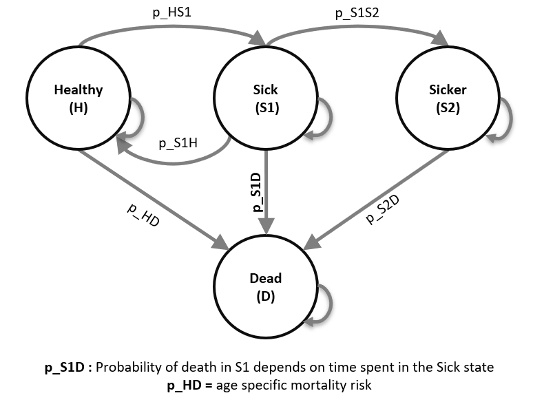

\newpage

```{r setup, include=FALSE}
knitr::opts_chunk$set(echo = TRUE, warning = FALSE, message = FALSE, eval = TRUE) # Change `eval` to `TRUE` if you want to knit this document. 

options(scipen = 999)  # disable scientific notation
rm(list = ls())        # clear memory (removes all the variables from the workspace)

```


This work is developed by the Decision Analysis in R for Technologies in Health (DARTH) workgroup:

- Fernando Alarid-Escudero, PhD
- Eva A. Enns, MS, PhD 
- M.G. Myriam Hunink, MD, PhD 
- Hawre J. Jalal, MD, PhD 
- Eline Krijkamp, PhD 
- Petros Pechlivanoglou, PhD
- Alan Yang, MSc

Please acknowledge our work. See details to cite below. 

# Exercise: A Microsimulation model – The Sick-Sicker model

In this exercise, we will model a hypothetical disease using an individual-based state-transition model, or what we often call a microsimulation model, called the "Sick-Sicker" model. This model has four health states (Figure 1): Healthy (H); two disease states, Sick (S1) and Sicker (S2); and Dead (D). 

```{r, echo = F, warning = F, message = F, out.width = '100%', fig.cap = 'Schematic representation of the Sick-Sicker model', fig.align = 'center'}
if (!require(here)) install.packages('here')
if (!require(knitr)) install.packages('knitr')

```

Advantages of using a microsimulation implementation is the ability to incorporate variation in the baseline characteristics for every individual and to keep track of state-residence. To illustrate this, we assume that individual mortality rates depend on baseline characteristics as well as time spend in the sick health state. 

After you have successfully implemented the Sick-Sicker model, you can expand the model to include the possibility of treatment and evaluate whether it is cost-effective given a willingness to pay of $50,000. This hypothetical treatment improves the quality of life for those in the Sick (S1) state but not for those in the Sicker (S2) state. However, it is not possible to distinguish between individuals in the Sick state from those in the Sicker state, so under a treatment strategy, individuals in both sick states must be treated (and incur the costs of treatment), while only those in the sick state benefit from it. 

In summary, the model assumes the following:

i)	The mortality rates depend on age

ii) Probability of dying when sick depends on state-residence in the Sick (S1) state.

iii) The improvement on quality of life by the treatment varies across individuals through a characteristic that acts as a treatment effect modifier. 
All model parameter values and `R` variable names are presented in Table 1.

\newpage

**Table 1: Input parameters for the time dependent Sick-Sicker Microsimulation **

|           **Parameter**            |  **R name** |   **Value**   |
|:-----------------------------------|:------------|:-------------:|
| Time horizon                       | `n_cycles`  | 30 years      |
| Cycle length                       |             | 1 year        |
| Names of simulated individuals     | `n_i`       | 100000          |
| Names of health states             | `v_names_states`       | H, S1, S2, D  |
| Annual discount rate (costs/QALYs) | `d_e` `d_c` | 3%            |
| Population characteristics         |             |               |
| - Age distribution                  |  --         | Range:25-55 distributed as in `MyPopulation-AgeDistribution.csv`|
| Annual transition probabilities conditional on survival   |             |               |
| - Disease onset (H to S1)          | `p_HS1`     |  0.15         |
| - Recovery (S1 to H)               | `p_S1H`     |  0.5          |
| - Disease progression (S1 to S2) under Standard of care   | `p_S1S2_SoC`    |  0.105        |
| - Disease progression (S1 to S2) under Strategy AB   | `p_S1S2_trtAB`    |  0.05        |
| Annual mortality                   |             |               |
| - All-cause mortality (H to D)     | `p_HD`      | Human Mortality Database (`mortProb_age.csv`): age dependent from 2015|
| - Probability of death is S1 (S1 to D) | `p_S1D` |  *(in template)       |
| - Probability of death in S2 (S2 to D) | `p_S2D` |  0.048        |
| Annual costs                       |             |               |
| - Healthy individuals              | `c_H`       |  $2,000       |
| - Sick individuals in S1           | `c_S1`      |  $4,000       |
| - Sick individuals in S2           | `c_S2`      |  $15,000      |
| - Dead individuals                 | `c_D`       |  $0           |
| - Additional costs of sick individuals treated in S1 or S2       | `c_trtAB` | $25,000 |
| Utility weights                    |             |               |
| - Healthy individuals              | `u_H`       |  1.00         |
| - Sick individuals in S1           | `u_S1`      |  0.75         |
| - Sick individuals in S2           | `u_S2`      |  0.50         |
| - Dead individuals                 | `u_D`       |  0.00         |
| Intervention effect                |             |               |
| - Utility for treated individuals in S1 | `u_trtAB` |  0.95        |
| Time varying extension of Sick-Sicker model |     |              |
| - Treatment effect modifier at baseline     | `v_x` | Uniform(0.95, 1.05) |


### Exercise - set-up
There are quite some steps you need to take in order to create a microsimulation model reflecting this case. Start by making sure that you have all the course material structured in the suggested way. There should be an R projects in the folder, a file ending on `.Rproj`, double click on this file to open the Rstudio environment. Working from a Rproject avoid struggles with working directories. 

While in you Microsim Sick-Sicker R project, open this `microsim_Sick-Sicker_time_template.Rmd`. This is a template that guides you step by step through the exercise. In addition it helps you to load the packages and the necessary data. The next chunk load the packages. 

# 01 Load packages

```{r}
if (!require('pacman')) install.packages('pacman'); library(pacman) 
# load (install if required) packages from CRAN
p_load("devtools", "dplyr", "scales", "ellipse", "ggplot2", "lazyeval", "igraph", "truncnorm", "ggraph", "reshape2", "knitr", "markdown", "stringr", "dampack")
# load (install if required) packages from GitHub
# install_github("DARTH-git/darthtools", force = TRUE) # Uncomment if there is a newer version
p_load_gh("DARTH-git/darthtools")
```


# 02 Load functions
There are no specific functions required for now. This is a placeholder for you. 
```{r}
# No functions needed
```

# 03 Model input
We load all the model input parameters as described in Table 1.
```{r}
## General setup 
set.seed(1)               # set the seed  
cycle_length   <- 1       # cycle length equal to one year (use 1/12 for monthly)
n_cycles       <- 30      # time horizon, number of cycles
n_i            <- 100000  # number of individuals

# the 4 health states of the model:
v_names_states  <- c("H",  # Healthy (H)
                     "S1", # Sick (S1)
                     "S2", # Sicker (S2)
                     "D")  # Dead (D)
v_names_cycles  <- paste("cycle", 0:n_cycles)    # cycle names
n_states        <- length(v_names_states) # number of health states               

### Discounting factors 
d_c <- 0.03 # annual discount rate for costs 
d_e <- 0.03 # annual discount rate for QALYs

### Strategies 
v_names_str   <- c("Standard of care",   # store the strategy names
                   "Strategy AB") 
n_str         <- length(v_names_str)     # number of strategies

### Transition probabilities 
# (all non-probabilities are conditional on survival)
p_HS1         <- 0.15     # probability of becoming sick when healthy
p_S1H         <- 0.5      # probability of recovering to healthy when sick
p_S1S2_SoC    <- 0.105    # probability of becoming sicker when sick under standard of care
p_S1S2_trtAB  <- 0.05     # probability of becoming sicker when sick under treatment AB

# Annual probabilities of death
# load age dependent probability
p_mort   <- read.csv("../data/mortProb_age.csv")
# load age distribution
dist_Age <- read.csv("../data/MyPopulation-AgeDistribution.csv") 

# probability to die in S1 by cycle (is increasing)
p_S1D    <- c(0.0149, 0.018, 0.021, 0.026, 0.031, rep(0.037, n_cycles - 5)) 
p_S2D    <- 0.048   # probability to die in S2

### State rewards 
#### Costs 
c_H     <- 2000  # annual cost of being Healthy
c_S1    <- 4000  # annual cost of being Sick
c_S2    <- 15000 # annual cost of being Sicker
c_D     <- 0     # annual cost of being dead
c_trtAB <- 25000 # annual cost of receiving treatment AB when in Sick
#### Utilities 
u_H     <- 1     # annual utility of being Healthy
u_S1    <- 0.75  # annual utility of being Sick
u_S2    <- 0.5   # annual utility of being Sicker
u_D     <- 0     # annual utility of being dead
u_trtAB <- 0.95  # annual utility when receiving treatment AB when in Sick

```

## 03.2 Calculate internal model parameters
``` {r}
### Discount weight for costs and effects 
v_dwc   <- 1 / ((1 + (d_e * cycle_length)) ^ (0:n_cycles))
v_dwe   <- 1 / ((1 + (d_c * cycle_length)) ^ (0:n_cycles))
```

# 04 Sample individual level characteristics

## 04.1 Static characteristics

```{r}
# sample the treatment effect modifier at baseline 
v_x     <- runif(n_i, min = 0.95, max = 1.05) 
# sample from the age distribution the initial age for every individual
v_age0  <- sample(x = dist_Age$age, prob = dist_Age$prop, size = n_i, replace = TRUE) 
```

## 04.2 Dynamic characteristics 
Here you need to specify the information regarding the initial health states of the individuals as well as in which health state each of the individuals start.  

```{r}
# Your turn

#v_M_init          <- [YOUR TURN]  # Specify the initial health state of the individuals 
#v_n_cycles_s_init <- [YOUR TURN]  # everyone begins in the healthy state (in this example)
```

## 04.3 Create a dataframe with the individual characteristics 
Now, it is time to merge the static and dynamic individual characteristics in one dataframe. Uncomment the #'s in code chunk below and run. 
```{r}
# Your turn - uncomment the #'s to create the dataframe 

# create a data frame with each individual's 
# ID number, treatment effect modifier, age and initial time in sick state and initial health state at the start of the simulation

#df_X <- YOUR TURN

#head(df_X)  # print the first rows of the dataframe
```

Interpretation of the dataframe: [YOUR TURN -> PLEASE INTERPRET WHAT YOU SEE AND ARGUE WHY THIS MAKES SENSE (or not)]

### Exercise - Task 1
Start making the functions `Probs()`, `Costs()` and `Effs()`. Make sure they are treatment-specific. 

# 05 Define Simulation Functions

## 05.1 Probability function
The `Probs` function updates the transition probabilities of every cycle is shown below. Important: 
(1) The probability from Sick (S1) to Sicker (S2) (`p_S1S2`) depends on the type of treatment. Make sure you incorporate this in the function 
(2) The probability to die when you are healthy now depends on age (example 3-state used sex)
(3) The probability from Sick to dead (`p_S1D`) depends on the number of cycles you have been in sick (`n_cycles_s`)

Please be reminded that the probabilities of transitioning from one state to the other (except to the Dead state) are conditional on staying alive. 
```{r}
# Your turn
# Probs <- function ( YOUR TURN)

```

## 05.2 Cost function

The `Costs` function estimates the costs at every cycle.
Remember treatment is given to both individuals in Sick and Sicker but only improved the quality of life of those in Sick. 

```{r}
# Your turn
#Costs <- function ( YOUR TURN)

```

## 05.3 Health outcome function

The `Effs` function to update the utilities at every cycle.
Remember treatment is given to both individuals in Sick and Sicker but only improved the quality of life of those in Sick in addition this utility has to be adjusted for the adjust for individual effect modifier. 
```{r}
# Your turn
# note the equation is more complicated compared to the 3-state example. Use the coding skills you learned so far to implement all the functionalists. This does require adding more arguments to the function and be creative with the if and else if statements. 

#Effs <- function ( YOUR TURN)


```


### Exercise - Task 2
Build the microsimulation model (function). Make sure you read the instructions carefully and remind yourself on the case example.
Remember to update any time varying personal characteristic, like age, at the end of each cycle. 

## 05.4 The Microsimulation function

```{r}
# Your turn

```

### Exercise - Task 3
Run the microsimulation model for both Standard of care and Strategy AB using a population of 100,000 individuals (`n_i`)

# 06 Run Microsimulation

```{r, eval = TRUE, echo = TRUE, warning = FALSE, message = FALSE, results = FALSE }
# Your turn
#outcomes_SoC   <- MicroSim(YOUR TURN)  # Run for Standard of Care
#outcomes_trtAB <- MicroSim(YOUR TURN) # Run simulation for strategy AB

 

```

### Exercise - Task 4
Visualize the distribution of the total cost per person, the total QALYs per person and show the distribution among the different health states (Markov trace). Do this for both Standard of Care as well as for Strategy AB

# 07 Visualize results

```{r}
# Standard of care
# Your turn

```

```{r}
# Strategy AB
# Your turn

```


### Exercise - Task 5
Estimate the cost-effectiveness of Strategy AB vs Standard of care.

# 08 Cost-effectiveness analysis (CEA) 

```{r}
# Your turn

```

```{r}
## CEA frontier 
# Your turn

```

### Exercise - Task 6	
Create a cost-effectiveness table with all results of interest.

```{r}
## CEA table in proper format 
# Your turn

```


We kindly request you to add the following Acknowledgement paragraph to your further work where DARTH code formed the basis. We also like to remind you that you can add other sources of reference to this paragraph to acknowledge code you got from others. 

# Acknowlegdement
For this work we made use of the template developed by the Decision Analysis in R for Technologies in Health (DARTH) workgroup: <http://darthworkgroup.com>.

The notation of our code is based on the following provided framework and coding convention: Alarid-Escudero, F., Krijkamp, E., Pechlivanoglou, P. et al. A Need for Change! A Coding Framework for Improving Transparency in Decision Modeling. PharmacoEconomics 37, 1329–1339 (2019). <https://doi.org/10.1007/s40273-019-00837-x>.

Other work from DARTH can be found on the website: <http://darthworkgroup.com/publications/>

# Copyright for assignment work
Copyright 2017, THE HOSPITAL FOR SICK CHILDREN AND THE COLLABORATING INSTITUTIONS.All rights reserved in Canada, the United States and worldwide. Copyright, trademarks, trade names and any and all associated intellectual property are exclusively owned by THE HOSPITAL FOR Sick CHILDREN and the collaborating  institutions. These materials may be used, reproduced, modified, distributed and adapted with proper attribution.
