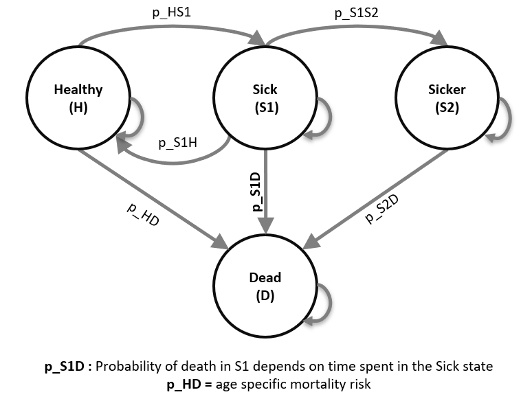

Developed by the Decision Analysis in R for Technologies in Health (DARTH) workgroup:

Fernando Alarid-Escudero, PhD (1) 

Eva A. Enns, MS, PhD (2)	

M.G. Myriam Hunink, MD, PhD (3,4)

Hawre J. Jalal, MD, PhD (5) 

Eline M. Krijkamp, MSc (3)	

Petros Pechlivanoglou, PhD (6,7)

Alan Yang, MSc (7)

In collaboration of: 		

1. Drug Policy Program, Center for Research and Teaching in Economics (CIDE) - CONACyT, 
   Aguascalientes, Mexico
2. University of Minnesota School of Public Health, Minneapolis, MN, USA
3. Erasmus MC, Rotterdam, The Netherlands
4. Harvard T.H. Chan School of Public Health, Boston, USA
5. University of Pittsburgh Graduate School of Public Health, Pittsburgh, PA, USA
6. University of Toronto, Toronto ON, Canada
7. The Hospital for Sick Children, Toronto ON, Canada

Please cite our publications when using this code:
 
- Jalal H, Pechlivanoglou P, Krijkamp E, Alarid-Escudero F, Enns E, Hunink MG. 
An Overview of R in Health Decision Sciences. Med Decis Making. 2017; 37(3): 735-746. 
https://journals.sagepub.com/doi/abs/10.1177/0272989X16686559
 
- Krijkamp EM, Alarid-Escudero F, Enns EA, Jalal HJ, Hunink MGM, Pechlivanoglou P. 
Microsimulation modeling for health decision sciences using R: A tutorial. 
Med Decis Making. 2018;38(3):400–22. 
https://journals.sagepub.com/doi/abs/10.1177/0272989X18754513
 
- Krijkamp EM, Alarid-Escudero F, Enns E, Pechlivanoglou P, Hunink MM, Jalal H. 
A Multidimensional Array Representation of State-Transition Model Dynamics. 
Med Decis Mak. 2020;40(2):242-248. https://doi.org/10.1177/0272989X19893973

Copyright 2017, THE HOSPITAL FOR SICK CHILDREN AND THE COLLABORATING INSTITUTIONS. 
All rights reserved in Canada, the United States and worldwide. Copyright, 
trademarks, trade names and any and all associated intellectual property are 
exclusively owned by THE HOSPITAL FOR Sick CHILDREN and the collaborating 
institutions. These materials may be used, reproduced, modified, distributed 
and adapted with proper attribution.

# Exercise I: A Microsimulation model – The Sick-Sicker model

In this exercise, we will model a hypothetical disease using an individual-based state-transition model, or what we often call a microsimulation model, called the "Sick-Sicker" model. This model has four health states (Figure 1): Healthy (H); two disease states, Sick (S1) and Sicker (S2); and Dead (D). 

Advantages of using a microsimulation implementation is the ability to incorporate variation in the baseline characteristics for every individual and to keep track of state-residence. To illustrate this, we assume that individual mortality rates depend on baseline characteristics as well as time spend in the sick health state. 

After you have successfully implemented the Sick-Sicker model, you can expand the model to include the possibility of treatment and evaluate whether it is cost-effective given a willingness to pay of $20,000. This hypothetical treatment improves the quality of life for those in the Sick (S1) state but not for those in the Sicker (S2) state. However, it is not possible to distinguish between individuals in the Sick state from those in the Sicker state, so under a treatment strategy, individuals in both sick states must be treated (and incur the costs of treatment), while only those in the sick state benefit from it. 

In summary, the model assumes the following:

i)	The mortality rates depend on age

ii) Probability of dying when sick depends on state-residence in the Sick (S1) state.

iii) The improvement on quality of life by the treatment varies across individuals through a characteristic that acts as a treatment effect modifier. 

All model parameter values and `R` variable names are presented in Table 1.

## Tasks

There are quite some steps you need to take in order to create a microsimulation reflecting this case. Start by download all the materials as a folder or collect all the files in one folder. If there is an R projects in the folder, a file ending on `.Rproj`, double click on this file to open an Rstudio environment. Working from a Rproject avoid struggles with working directories. 

1. Open the file `microsim_Sick-Sicker_time_template.Rmd`. This is a template to load the data for the time dependency and the necessary data. Start making the functions `Probs()`, `Costs()` and `Effs()`.

2. Build your microsimulation model (function). Then, simulate a population of 100,000 individuals and plot the resulting distributions of remaining lifetime costs and QALYs. Please be reminded that the probabilities of transitioning from one state to the other (except to the Dead state) are conditional on staying alive. 

3. Expand your microsimulation model to include the possibility of the hypothetical treatment for the disease in the Sick-Sicker model (and its impact on costs and quality of life). Remember treatment is given to both individuals in Sick and Sicker but only improved the quality of life of those in Sick. Create a new variable within the model function that can be used to turn treatment on and off in the model.

4. Simulate a population of 100,000 individuals under a treatment strategy where anyone who is sick (in the Sick or Sicker states) receives treatment. Plot the resulting distributions of remaining lifetime costs and QALYs.

5. Calculate the incremental cost-effectiveness ratio (ICER) of treatment compared to no treatment (see code template).

\newpage

**Table 1: Input parameters for the time dependent Sick-Sicker Microsimulation **

|           **Parameter**            |  **R name** |   **Value**   |
|:-----------------------------------|:------------|:-------------:|
| Time horizon                       | `n_t`       | 30 years      |
| Cycle length                       |             | 1 year        |
| Names of simulated individuals     | `n_i`       | 1000          |
| Names of health states             | `v_n`       | H, S1, S2, D  |
| Annual discount rate (costs/QALYs) | `d_e` `d_c` | 3%            |
| Population characteristics         |             |               |
| - Age distribution                  |  --         | Range:25-55 distributed as in `MyPopulation-AgeDistribution.csv`|
| Annual transition probabilities conditional on survival   |             |               |
| - Disease onset (H to S1)          | `p_HS1`     |  0.15         |
| - Recovery (S1 to H)               | `p_S1H`     |  0.5          |
| - Disease progression (S1 to S2)   | `p_S1S2`    |  0.105        |
| Annual mortality                   |             |               |
| - All-cause mortality (H to D)     | `p_HD`      | Human Mortality Database (`mortProb_age.csv`): age dependent from 2015|
| - Probability of death is S1 (S1 to D) | `p_S1D` |  *(in template)       |
| - Probability of death in S2 (S2 to D) | `p_S2D` |  0.048        |
| Annual costs                       |             |               |
| - Healthy individuals              | `c_H`       |  $2,000       |
| - Sick individuals in S1           | `c_S1`      |  $4,000       |
| - Sick individuals in S2           | `c_S2`      |  $15,000      |
| - Dead individuals                 | `c_D`       |  $0           |
| - Additional costs of sick individuals treated in S1 or S2       | `c_trt` | $12,000 |
| Utility weights                    |             |               |
| - Healthy individuals              | `u_H`       |  1.00         |
| - Sick individuals in S1           | `u_S1`      |  0.75         |
| - Sick individuals in S2           | `u_S2`      |  0.50         |
| - Dead individuals                 | `u_D`       |  0.00         |
| Intervention effect                |             |               |
| - Utility for treated individuals in S1 | `u_trt` |  0.95        |
| Time varying extension of Sick-Sicker model |     |              |
| - Treatment effect modifier at baseline     | `v_x` | Uniform(0.95, 1.05) |


```{r, echo = F, warning = F, message = F, out.width = '100%', fig.cap = 'Schematic representation of the Sick-Sicker model', fig.align = 'center'}
if (!require(here)) install.packages('here')
if (!require(knitr)) install.packages('knitr')

```
