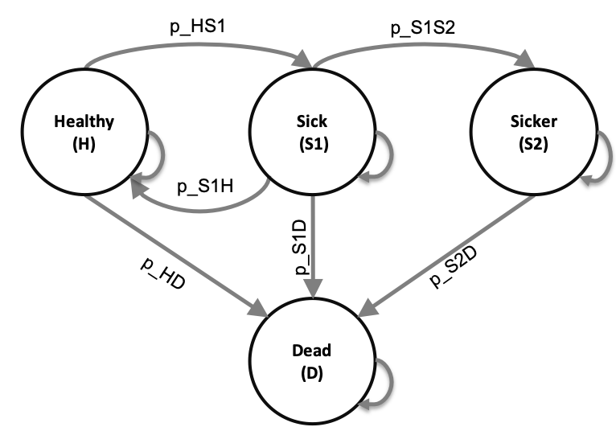

Developed by the Decision Analysis in R for Technologies in Health (DARTH) workgroup:

Fernando Alarid-Escudero, PhD (1) 

Eva A. Enns, MS, PhD (2)	

M.G. Myriam Hunink, MD, PhD (3,4)

Hawre J. Jalal, MD, PhD (5) 

Eline M. Krijkamp, MSc (3)	

Petros Pechlivanoglou, PhD (6,7)

Alan Yang, MSc (7)

In collaboration of: 		

1. Division of Public Administration, Center for Research and Teaching in 
   Economics (CIDE), Aguascalientes, Mexico
2. University of Minnesota School of Public Health, Minneapolis, MN, USA
3. Erasmus MC, Rotterdam, The Netherlands
4. Harvard T.H. Chan School of Public Health, Boston, USA
5. University of Pittsburgh Graduate School of Public Health, Pittsburgh, PA, USA
6. University of Toronto, Toronto ON, Canada
7. The Hospital for Sick Children, Toronto ON, Canada

Please cite our publications when using this code:
 
- Jalal H, Pechlivanoglou P, Krijkamp E, Alarid-Escudero F, Enns E, Hunink MG. 
An Overview of R in Health Decision Sciences. Med Decis Making. 2017; 37(3): 735-746. 
https://journals.sagepub.com/doi/abs/10.1177/0272989X16686559

- Alarid-Escudero F, Krijkamp EM, Enns EA, Yang A, Hunink MGM Pechlivanoglou P,
Jalal H. Cohort State-Transition Models in R: A Tutorial. arXiv:200107824v2. 
2020:1-48. http://arxiv.org/abs/2001.07824

- Krijkamp EM, Alarid-Escudero F, Enns EA, Jalal HJ, Hunink MGM, Pechlivanoglou P. 
Microsimulation modeling for health decision sciences using R: A tutorial. 
Med Decis Making. 2018;38(3):400–22. 
https://journals.sagepub.com/doi/abs/10.1177/0272989X18754513
 
- Krijkamp EM, Alarid-Escudero F, Enns E, Pechlivanoglou P, Hunink MM, Jalal H. 
A Multidimensional Array Representation of State-Transition Model Dynamics.
Med Decis Making.2020 Feb;40(2):242-248. https://doi.org/10.1177/0272989X19893973

Copyright 2017, THE HOSPITAL FOR SICK CHILDREN AND THE COLLABORATING INSTITUTIONS. 
All rights reserved in Canada, the United States and worldwide. Copyright, 
trademarks, trade names and any and all associated intellectual property are 
exclusively owned by THE HOSPITAL FOR SICK CHILDREN and the collaborating 
institutions. These materials may be used, reproduced, modified, distributed 
and adapted with proper attribution.

# Exercise I: Construct a Markov Model of the Sick-Sicker Disease

In this exercise, we will model a hypothetical disease that affects individuals with an average age of 25 years and results in increased mortality, increased healthcare costs, and reduced quality of life. The disease has two levels; affected individuals initially become sick but can subsequently progress and become sicker. Two alternative strategies exist for this hypothetical disease: Standard of Care (SoC) and a treatment strategy - Strategy AB. Under the treatment strategy, individuals in the sick and sicker states are treated until they recover (only if sick; individuals in the sicker state cannot recover) or die. The cost of the treatment is additive to the baseline healthcare costs of being sick or sicker. The treatment improves quality of life for those individuals who are sick but has no impact on the quality of life of those who are sicker. Unfortunately, it is not possible to reliably differentiate between people in the sick and sicker states, so treatment cannot be targeted to only those in the sick state. You are asked to evaluate the cost-effectiveness of the treatment.

To model this disease, we will rely on a state-transition cohort model, called the Sick-Sicker model, first described by Enns et al. The Sick-Sicker model consists of four health states: Healthy (H), two disease states, Sick (S1) and Sicker (S2), and Dead (D) (Figure 1). All individuals start in the Healthy state. Over time, healthy individuals may develop the disease and can progress to S1. Individuals in S1 can recover (return to state H), progress further to S2 or die. Individuals in S2 cannot recover (i.e. cannot transition to either S1 or H). Individuals in H have a baseline probability of death; individuals in S1 and S2 experience increased mortality compared to those in the H state, given in terms of hazard ratios. These ratios are used to calculate the probabilities of dying when in S1 and S2. 

```{r, echo = F, warning = F, message = F, out.width = '100%', fig.cap = 'Schematic representation of the Sick-Sicker model', fig.align = 'center'}
if (!require(knitr)) install.packages('knitr')

```

# Tasks (COMPLETED)

Using the template `markov_sick-sicker_time_template.Rmd`, please do the following. 

1.	Build the Markov model in `R` for Standard of Care (SoC) and Strategy AB including age-dependent mortality. 

2.	Estimate the cost-effectiveness of Strategy AB vs SoC.

3.	Create a cost-effectiveness table with all results of interest.

**Table I: Input parameters**

|           **Parameter**            |  **R name** |   **Value**   |
|:-----------------------------------|:------------|:-------------:|
| Cycle length                       | `cycle_length`          | 1  year           |
| Age at baseline                    | `n_age_init`            | 25 years old      |
| Maximum age of follow-up           | `n_age_max`             | 100 years old     |
| Names of health states             | `v_names_states`        | H, S1, S2, D      |
| Names of cycles (time horizon)     | `n_cycles`              | (n_age_max - n_age_init) / cycle_length |
| Annual discount rate (costs/QALYs) | `d_c`/ `d_e`       | 3%                      |
| Annual transition probabilities conditional on surviving   |     |                |
| - Rate of becoming S1 when H               | `r_HS1`     |  0.15          |
| - Rate of becoming H when S1               | `r_S1H`     |  0.5           |
| - Rate of becoming S2 when S1                | `r_S1S2`    |  0.105         |
| Annual mortality                                   |             |                |
| - All-cause mortality (H to D)     | `v_r_HD`      | `HMD - info below`   |
| - Hazard ratio of death in S1 vs H | `hr_S1`       |  3          |
| - Hazard ratio of death in S2 vs H | `hr_S2`       |  10         |
| - Hazard ratio of becoming Sicker when Sick under Strategy AB  | `hr_S1S2_trtAB`       |  0.6         |
| Annual costs                       |             |               |
| - Healthy individuals              | `c_H`       |  $2,000       |
| - Sick individuals in S1           | `c_S1`      |  $4,000       |
| - Sick individuals in S2           | `c_S2`      |  $15,000      |
| - Dead individuals                 | `c_D`       |  $0           |
| - Additional costs of sick individuals treated with Strategy AB in S1 or S2       | `c_trtAB` | $25,000 |
| Utility weights                    |             |               |
| - Healthy individuals              | `u_H`       |  1.00         |
| - Sick individuals in S1           | `u_S1`      |  0.75         |
| - Sick individuals in S2           | `u_S2`      |  0.50         |
| - Dead individuals                 | `u_D`       |  0.00         |
| - Utility for individuals treated with Strategy AB in S1 | `u_trtAB` |  0.95        |
| Transition rewards              |             |               |
| - Disutility when transitioning from H to S1             | `du_HS1`       |  0.01      |
| - Increase in cost when transitioning from H to S1           | `ic_HS1`      |  1000         |
| - increase in cost when dying          | `ic_D`      |  2000         |

*Note: To calculate the probability of dying from S1 and S2, use the hazard ratios provided. To do so, first multiply the rate of dying from healthy by the appropriate hazard ratio; finally, convert this rate back to a probability. Recall that you can convert between rates and probabilities using the following formulas: $r = -log(1-p)$ and $p = 1-e^{(-rt)}$. The package `darthtools` also has the functions `prob_to_rate` and `rate_to_prob` that might be of use to you.

* 1. *HMD* : This is the Human mortality database. We provide you a files called `HMD_USA_Mx_2015.csv` with the age specific mortality rates. The data has the columns X, Year, Age, Female, Male, Total and OpenInterval. We will use the overall age specific mortality rate from the Total column.

## Age specific all cause mortality

The code below shows you how to get the data into your R environment. We also provide this in the template. You can use function `rate_to_prob` to convert `v_r_HD` into `v_p_HD`.

```{r, echo = FALSE}
lt_usa_2015 <- read.csv("../data/HMD_USA_Mx_2015.csv")
head(lt_usa_2015)
```

```{r, eval = FALSE}
# Transition probabilities (per cycle) and hazard ratios
# Read age-specific mortality rates from csv file
# if you have the data in the same folder as you markdown
#lt_usa_2015 <- read.csv("HMD_USA_Mx_2015.csv")

# if you have a data folder
lt_usa_2015 <- read.csv("../data/HMD_USA_Mx_2015.csv")

# select the age-specific mortality rates from csv file for the age 25 - 54
v_r_HD <- lt_usa_2015 %>% 
  filter(Age >= age & Age <= (max_age - 1)) %>%
  select(Total) %>%
  as.matrix()
```

\newpage

# Exercise II: Probabilistic sensitivity analysis of the Sick-Sicker Markov model

This exercise continues based on the cohort state transition  "Sick-Sicker" model from Exercise I. In this exercise, you will build a probabilistic sensitivity analysis (PSA) with 1000 simulations `(n_sim)`. Table II describes the distributions for the variables you used in the previous exercise.

**Table II: Input parameters for probabilistic analysis**

|           **Parameter**            |  **Distribution** |            **Distribution values**            |
|:-----------------------------------|------------------:|----------------------------------------------:|
| Annual transition probabilities conditional on surviving   |     |                |
| - Rate of becoming S1 when H               | Gamma     |  shape = 30, rate = 170 + 300             |
| - Rate of becoming H when S1               | Gamma   |  shape = 60, rate = 60 + 60           |
| - Rate of becoming S2 when S1                | `r_S1S2`    |  shape = 84, rate = 716 + 84     |
| Annual mortality                                   |             |                |
| - Hazard ratio of death in S1 vs H | Lognormal      |  $\mu = \text{log}(3), \ \sigma = 0.01$             |
| - Hazard ratio of death in S2 vs H | Lognormal       |  $\mu = \text{log}(10), \ \sigma = 0.02$            |
| - Hazard ratio of becoming Sicker when Sick under Strategy AB  | Lognormal    |  $\mu = \text{log}(0.6), \ \sigma = 0.02$          |
| Annual costs                       |             |               |
| - Healthy individuals              | Gamma      |  shape = 100, scale = 20     |
| - Sick individuals in S1           | Gamma      |  shape = 177.8, scale = 22.5      |
| - Sick individuals in S2           | Gamma      |  shape = 225,   scale = 66.7  |
| - Additional costs of sick individuals treated with Strategy AB in S1 or S2       | Gamma | shape = 156.3, scale = 160 |
| Utility weights                    |             |               |
| - Healthy individuals              | Beta      |  $\alpha = 200, \ \beta = 3$        |
| - Sick individuals in S1           | Beta     | $\alpha = 130, \ \beta = 45$         |
| - Sick individuals in S2           | Beta      | $\alpha = 230, \ \beta = 230$         |
| - Utility for individuals treated with Strategy AB in S1 | Beta | $\alpha = 300, \ \beta = 15$        |
| Transition rewards              |             |               |
| - Disutility when transitioning from H to S1             | Beta       |  $\alpha = 11, \ \beta = 1088$     |
| - Increase in cost when transitioning from H to S1           | Gamma     |  shape = 25,  scale = 40         |
| - increase in cost when dying          | Gamma     |  shape = 100, scale = 20         |

## Tasks

1. Open the file `markov_sick-sicker_time_SA_template.R` and move to "10 Deterministic Sensitivity Analysis (DSA)". Run all code before this section. 

1. Complete the `calculate_ce_out` function of the Sick-Sicker Markov model in the file `Functions_markov_sick-sicker_time.R`. Load this function file in to `R`.

1. Conduct a one-way sensitivity analysis (OWSA) on parameters `r`_S1S2` [0.05, 0.155], `c_trtAB` [18000, 36000], `u_S1` [0.65, 0.85], `u_trtAB` [0.80, 0.98]. Use net monetary benefit as the outcome. Plot 1) OWSA results, 2) OWSA optimal strategy, and 3) a Tornado plot. The [min, max] contains the range of each parameter for the sensitivity analysis.

1. Conduct a two-way sensitivity analysis (TWSA) on parameters `c_trtAB` [18000, 36000] and `u_trtAB` [0.80, 0.98]. Use net monetary benefit as the outcome. Plot TWSA results.

1. Use a function called `generate_psa_params` to sample values for the uncertain parameters using the appropriate distributions. 

1. Create a histogram of each of the model input parameters.

1. Create a cost-effectiveness plane to present discounted costs and QALYs.

1. Create the cost-effectiveness acceptability curves (CEAC) and frontier (CEAF) for the treatment comparison assuming WTP thresholds of $\$0$ to $\$200,000$.

1. Create the expected loss curves (ELC) plot

1. Create an expected value of perfect information (EVPI) plot. 

